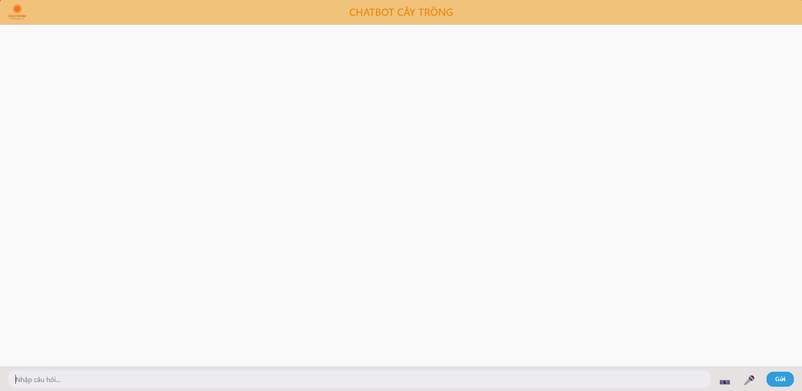

# CHATBOT CHĂM SÓC CÂY TRỒNG 🌿🤖

Đây là một hệ thống chatbot thông minh hỗ trợ người dân chăm sóc cây trồng. Chatbot có thể:
- Nhận diện bệnh từ hình ảnh cây trồng bằng YOLOv8
- Mô tả hình ảnh bằng AI (BLIP Captioning)
- Trả lời câu hỏi bằng mô hình ngôn ngữ lớn (LLM)
- Hỗ trợ tiếng Việt và tiếng Anh
- Nhận câu hỏi từ ảnh hoặc văn bản

## 📦 Công nghệ sử dụng

- **Flask** – Server backend API
- **ReactJS** – Giao diện chatbot
- **YOLOv8** – Nhận diện bệnh từ ảnh
- **Hugging Face API** – Mô tả ảnh và xử lý ngôn ngữ
- **Ultralytics** – Triển khai YOLOv8
- **PIL** – Xử lý ảnh
- **CORS** – Cho phép frontend truy cập backend

## 🖼️ Giao diện hệ thống

Giao diện người dùng đơn giản, dễ sử dụng như chatbot thông thường:




# Hướng dẫn chạy project

## Cài đặt thư viện Python

```bash
pip install flask flask-cors requests ultralytics pillow
```

## Chạy backend

```bash
python app.py
```

## Chạy frontend

```bash
cd chatbot-caytrong
npm install
npm start
```

